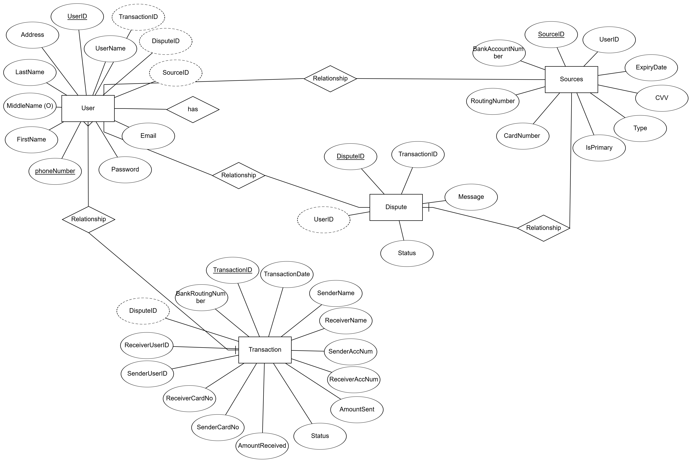

# CashCow

**Developer:** Sagar Bangera

CashCow is a comprehensive payment tracking and management system that simplifies financial transactions. The application enables users to manage payment sources, perform secure transactions, resolve disputes, and track transaction histories. It is built with a focus on user-friendliness, administrative control, and analytical insights, making it suitable for personal and organizational use. The app includes distinct user roles (admin and customer), ensuring a robust experience for different users.

## Table of Contents
- [Overview](#overview)
- [Technologies Used](#technologies-used)
- [Features](#features)
- [ER Diagram](#er-diagram)
- [Usage](#usage)
- [Database Schema](#database-schema)
- [Future Enhancements](#future_enhancements)

## Overview

Primary Use Cases

Customers:
Manage payment sources.
Initiate secure transfers.
Track transaction history.
Raise disputes for erroneous transactions.

Admins:
View and manage disputes raised by customers.
Access analytical insights on users and transactions.
Manage user details and ensure platform integrity.

## Technologies Used
Technologies Used
Backend: Flask (Python)
Frontend: HTML, CSS, Chart.js
Database: MySQL
Other Tools:
MySQL for database interaction.
YAML for configuration management.

## Features

Secure Authentication:
Hashing passwords using MD5 for secure storage and validation.
Role-based authentication for admins and customers.

User Management:
Admins can view and manage user details.
Customers can register, login, and manage payment sources.

Transaction Management:
Real-time balance deduction and validation for transfers.
Multi-source payments using primary and secondary sources.

Dispute Resolution:
Customers can raise disputes on transactions.
Admins can approve or reject disputes via the admin dashboard.

Analytics:
Track platform activity to identify trends and growth.

## ER Diagram

The ER diagram represents the structure of the application's database. It includes the following key entities:

Credentials/User: Stores user credentials like email, password, name, and an optional phone number. Each user has a one-to-many relationship with their bank details.

UserBankDetails: Stores the user’s bank information, such as account numbers, routing numbers, and optional bank names. A user can have between 1 and 5 bank accounts.

Transaction: Records details of each transaction, including sender and receiver account numbers, routing numbers, and transaction dates. The transaction is linked to the user's bank details and authorized through a verification process.

SavedUsers: Allows users to store information about other users they frequently send payments to, including their account and routing numbers.

Bank: Stores bank-related information and ensures proper routing of transactions by verifying account details through the BankAuth entity.

## Usage

Admin:
Main Purpose: Monitor and manage disputes, users, and transactions. Provides insights and platform management capabilities.

Customer:
Main Purpose: Handle personal transactions and resolve issues using disputes.

## Credentials
| User Role | Username   | Password |
|-----------|------------|----------|
| Admin     | admin1     | 1234     |
| Customer  | jaya0505   | 1234     |
| Customer  | ashishjuttu| 1234     |
## SQL Queries

Retrieve Recent Transactions by User:

SELECT 
    TransactionID, SenderName, ReceiverName, AmountSent, Status, TransactionDate
FROM 
    transaction
WHERE 
    SenderName = %s OR ReceiverName = %s
ORDER BY 
    TransactionID DESC
LIMIT %s;

Raise a Dispute:

INSERT INTO disputes (TransactionID, UserID, Message, Status)
VALUES (%s, %s, %s, 'Pending');
Set a Payment Source as Primary:

UPDATE sources
SET IsPrimary = 1
WHERE SourceID = %s;

Count Weekly Transactions:

SELECT 
    YEARWEEK(TransactionDate, 1) AS Week, COUNT(*) AS TransactionCount
FROM 
    transaction
GROUP BY 
    YEARWEEK(TransactionDate, 1);
Count Weekly Users:

SELECT 
    YEARWEEK(CreatedAt, 1) AS Week, COUNT(*) AS UserCount
FROM 
    users
WHERE 
    Role = 'customer'
GROUP BY 
    YEARWEEK(CreatedAt, 1);
    
Total Disputes Per Status:

SELECT 
    Status, COUNT(*) AS DisputeCount

FROM 
    disputes
GROUP BY 
    Status;

## Future Enhancements

Add an extra layer of security for login.
Integrate more detailed metrics, such as monthly reports and growth trends.
Notify users when transactions are completed or disputes are resolved.
Implement logging for admin actions and dispute resolutions.
